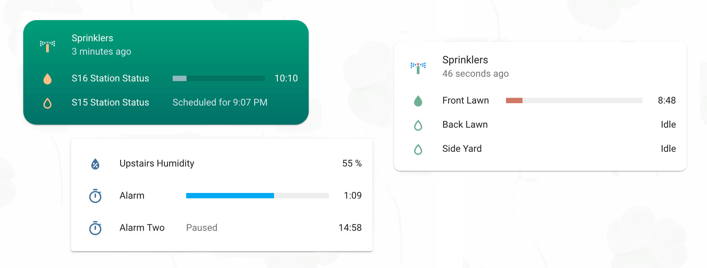
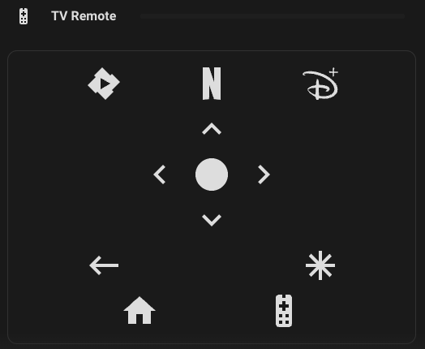

# HA Configuration

Hello There! I have been getting requests to expose my dashboards to the public for viewing. Well in this repo you will find my [raw-configuration](./raw-configuration.yaml) with a bunch of stuff ripped out of it for PII reasons.

## Quick Notes

The top 25% of the dashboard consists of very useful information for our household to show things that need to be acted on, or information about what is happening in the house (doors unlocked/opened, media playing, Vacuum running, Washer running, etc).

Below that, Rooms become the basis of this dashboard. It gives a great virtual feel of being in the room itself. Each set of rooms is contained by a floor. 

I have grouped lights and switches using the `Helpers > Group > Light Group` with like `All Main Floor Lights` or `All Basement Lights`. Then Each room has a light group itself (very much like google/alexa handle area grouping - I tried to mimic that) so `Office Lights` would be a group of all the lights in the office. Or `Kitchen Lights` would be the 4 lights we have in the kitchen.

The horizontal flow at the bottom of the page is part of the [Bubble Card](./README.md#bubble-card) integration. Each room can potentially have a motion sensor attached to it so that the buttons will rearrange themselves when they are occupied.

## Live Demo

Click [here](https://photos.app.goo.gl/ARhj3e4pBj2PvSt68)(Google Photos Album) to see the Live Demo

## Integrations/Addons

### Addons

- [Zwave JS UI](https://github.com/zwave-js/zwave-js-ui)
  - All of my Switches are Zooz 800 switches
- [Zigbee2MQTT](https://www.zigbee2mqtt.io/)
  - I run all of my philips hue bulbs on my ZBT-1 stick through Zigbee2MQTT
- [Music Assistant Server](https://github.com/music-assistant/server)

### HACS Frontend Integrations

#### Mushroom

#### Bubble Card

#### Mini Media Player

#### Atomic Calendar Revive

| Event Mode                                                                                                                             | Calendar Mode                                                                                                                            |
| -------------------------------------------------------------------------------------------------------------------------------------- | ---------------------------------------------------------------------------------------------------------------------------------------- |
|  |  |
|  |   |

#### Timer Bar Card (not pictured in videos)

#### Universal Remote

#### Time Picker Card

#### Trash Card (Not Pictured in my videos)

### HACS Integrations

#### WebRTC Camera

#### GE Home Appliances (Custom Source)

Entities card:

Fridge Controls:

Oven Controls:

A/C Controls:

For installation - Please follow directions [here](https://hacs.xyz/docs/faq/custom_repositories/), and use https://github.com/simbaja/ha_gehome as the repository URL.

#### Keymaster (Not pictured in videos)

Please see their [wiki](https://github.com/FutureTense/keymaster/wiki) for setup instructions.

#### Google Keep Sync (for todo lists/shopping lists)

This is a direct integration with Home Assistant's built-in todos. Please read [all the docs](https://github.com/watkins-matt/home-assistant-google-keep-sync/blob/main/README.md) for setup instructions.

